# Projeto Fisíca Óptica

Projeto semestral da matéria de Física Óptica, ministrada no Centro Universitário FEI. Consiste em alguns programas desenvolvidos em python com o intuito de realizar alguns cálculos

## Funcionalidade - Projeto 1: Ondulatória

O programa realiza cálculos de conversões de ondas eletromagnéticas, campos magnéticos e elétricos

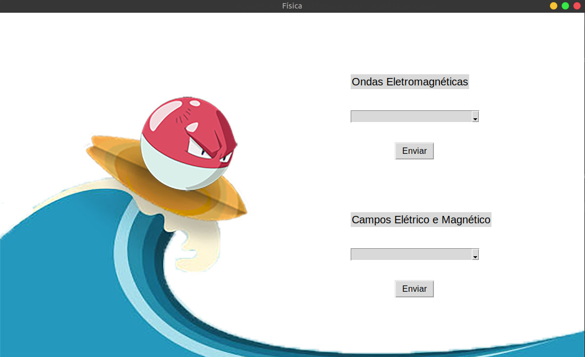

**1 - Ondas eletromagnéticas** - É possível realizar dois tipos de conversão: "Conversão de λ para f" e "Conversão de f para λ".

É exibido ao usuário no primeiro tipo de conversão a frequência e o tipo de onda eletromagnética. Já no segundo é exibido além do tipo o comprimento da onda.

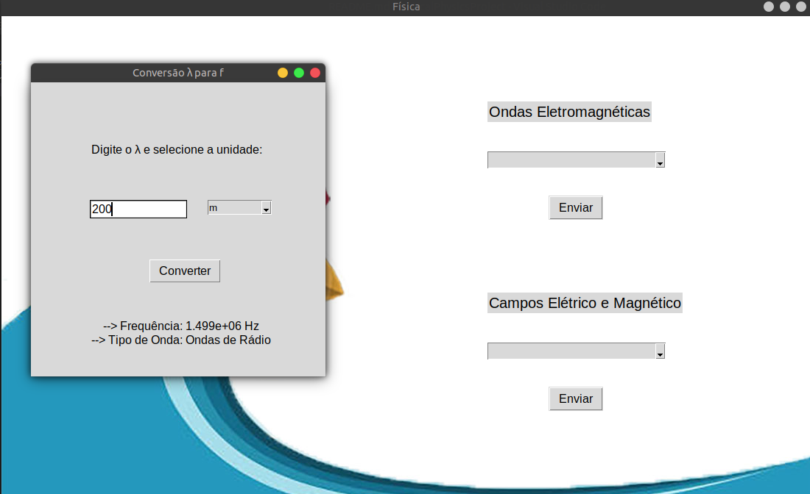
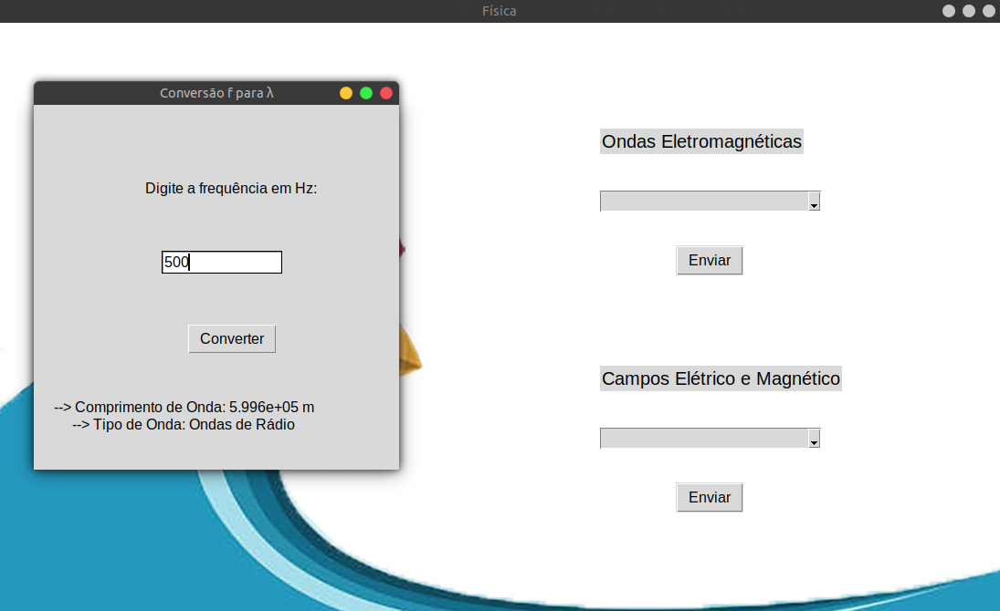

**2 - Campos Elétrico e Magnético** - É possível realizar seis tipos de cálculo: "Cálculo do campo Bm", "Cálculo do campo Em", "Número de onda", "Frequência angular", "Tipo de onda com k" e "Tipo de onda com ω".

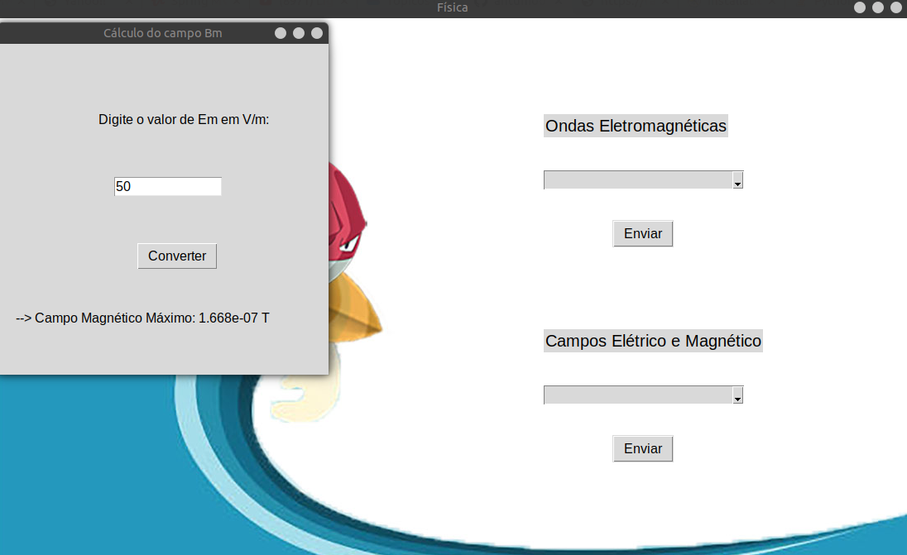
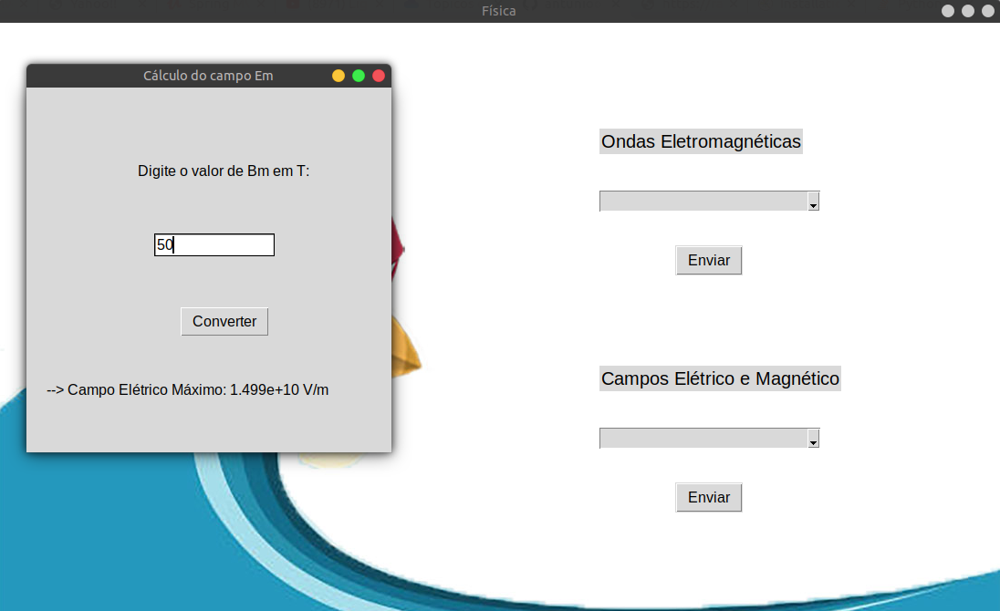

No cálculo de número de onda e frequência angular é possível utilizar tanto a frequência como o comprimento de onda para se calcula-la. 

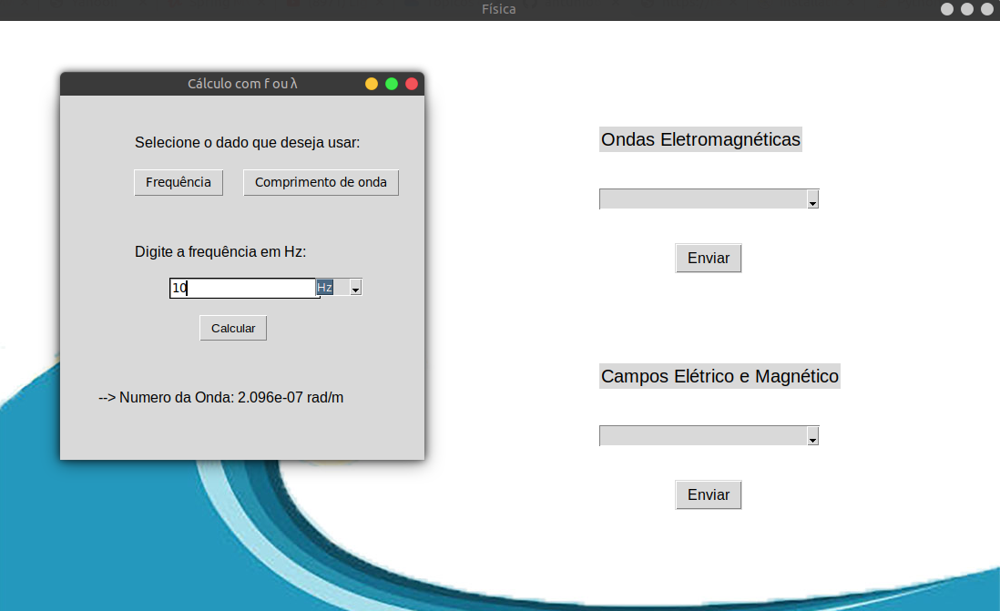
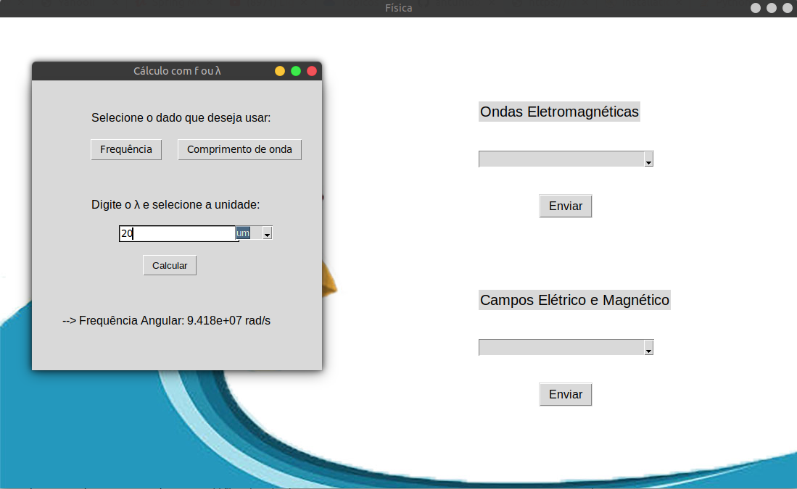

É possível descobrir o tipo de onda utilizando não só o k como também o ω

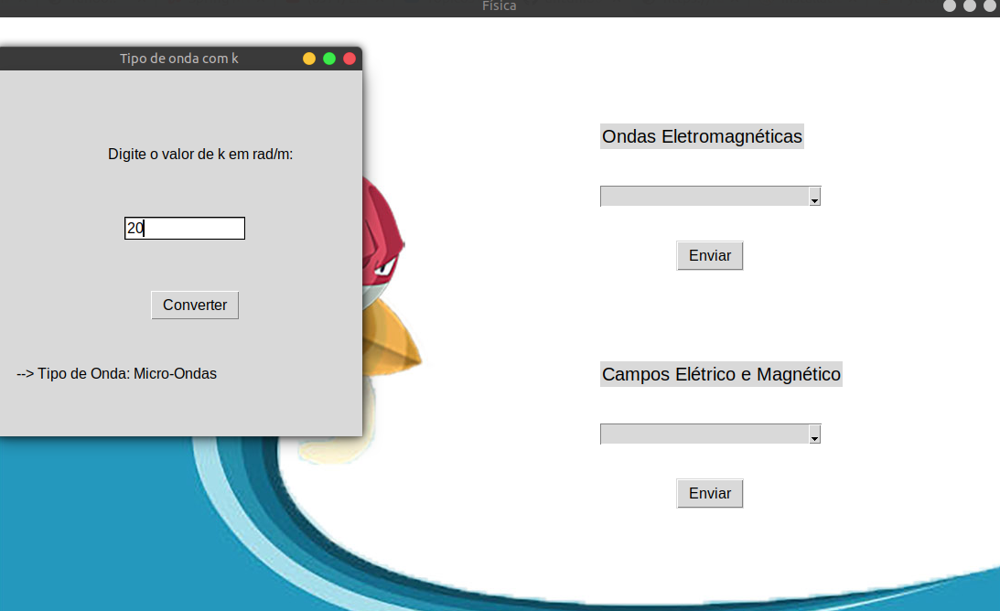
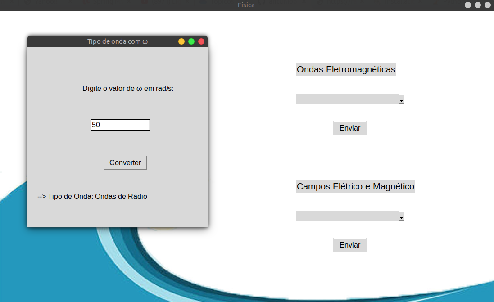


## Funcionalidade - Projeto 2: Polarizadores

O programa realiza cálculos de intensidade de luz entre polarizadores. Assim que inicia é possível selecionar o número de polarizadores.

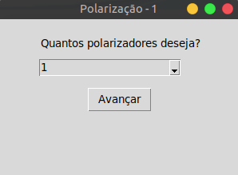

**Cálculo** - De acordo com o número de polarizadores deve-se também inserir o valor do ângulo.

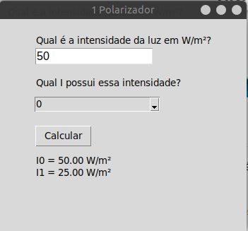
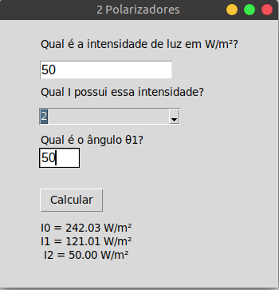
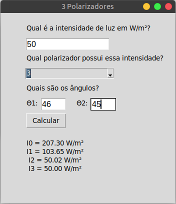

## Execução

Tanto no Windows quanto no Linux a execução é feita a partir da execução da linha a seguir no terminal, ou utilizando uma IDE de sua preferência. 

Inicialmente deve-se instalar as bibliotecas necessárias:

```bash
python -m pip install -U pip
python -m pip install -U scipy
```

```bash
python main.py
```

Entretanto, utilizando apenas a linha acima é possivel que o compilador de sua máquina utilize o python em sua versão 2.7. Para resolver isso é mais vantajoso utilizar:

```bash
python3 main.py
```

Caso você esteja utilizando o Windows é possível executar o projeto apenas executando o arquivo "clickme.exe.bat"